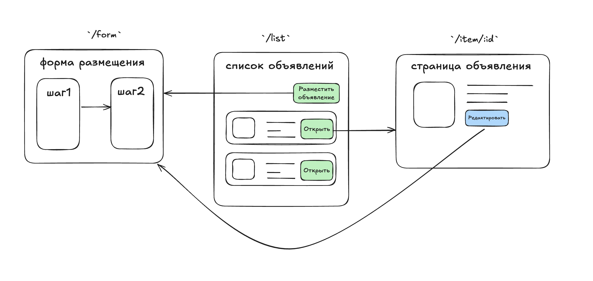

# Суть задания:
Разработать клон Авито с базовыми возможностями по работе с объявлениями. Приложение должно поддерживать размещение, редактирование и отображение объявлений в трёх различных категориях: недвижимость, авто и услуги.

# Функциональные требования:
* Размещение объявлений: форма с несколькими шагами для размещения объявлений
* Список объявлений: отображение всех размещённых объявлений
* Просмотр объявлений: детальная карточка объявления с возможностью редактирования
* Редактирование объявлений: изменение существующих объявлений с предзаполненными данными
* Авторизация: (Дополнительно) авторизация пользователей для размещения и редактирования объявлений

### Маршрутизация
* /form — для размещение и редактирования объявлений
* /list — для отображения списка объявлений
* /item/:id — для просмотра конкретного объявления

### Шаги формы
* Основной шаг (для всех категорий)
* Название (обязательное)
* Описание (обязательное)
* Локация (обязательное)
* Фото (необязательное)
* Категория объявления (выпадающий список: Недвижимость, Авто, Услуги) (обязательное)

Категорийный шаг
Зависит от выбранной категории для объявления:

#### Недвижимость:

* Тип недвижимости (например: квартира, дом, коттедж и т.д.) (выпадающий список, обязательное, строка)
* Площадь (кв. м, обязательное, число)
* Количество комнат (обязательное, число)
* Цена (обязательное, число)

#### Авто:

* Марка (выпадающий список, обязательное, строка)
* Модель (обязательное, строка)
* Год выпуска (обязательное, число)
* Пробег (км, опциональное, число)

#### Услуги:

* Тип услуги (например: ремонт, уборка, доставка) (выпадающий список, обязательное, строка)
* Опыт работы (лет, обязательное, число)
* Стоимость (обязательное, число)
* График работы (опциональное, строка)

*Если форма находится в режиме редактирования, нужно отобразить это визуально (например, с помощью заголовка) Также должна быть реализована валидация всех полей*

#### Список объявлений
* Максимальное количество объявлений на странице — 5
* После размещения объявление отображается в списке на маршруте /list
* На странице есть кнопка «Разместить объявление», которая будет вести на форму
* Превью объявления в списке показывает фото (или заглушку, если фото нет), название, локацию и категорию объявления (авто, недвижимость или услуга)
* Есть кнопка «Открыть», которая ведёт на страницу объявления /item/:id
* Реализован поиск объявления по названию
* Реализована пагинация (допускается как на клиенте, так и на сервере)
* Реализована фильтрация по категории объявления
* Дополнительно: при выборе значения для фильтра по категории появляются дополнительные фильтры по обязательным полям выбранной категории

#### Просмотр и редактирование
* При клике на объявление в списке открывается подробная карточка со всем полями
* Возможность редактирования объявления: переход на /form с предзаполненными данными

#### Сохранение данных (Дополнительно)
* При перезагрузке страницы данные формы должны сохраняться в черновик

***Тестовое задание на стажировку Авито 2025 (текст взят с открытого репозитория)***